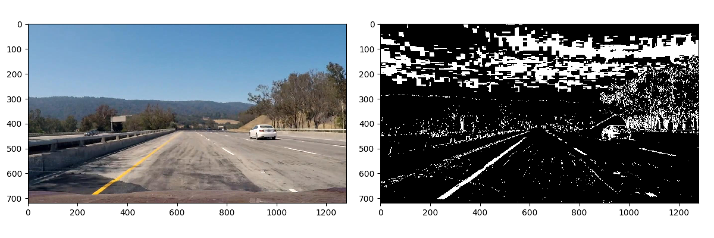
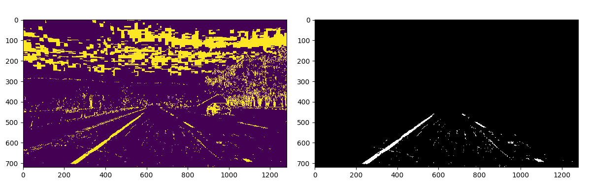
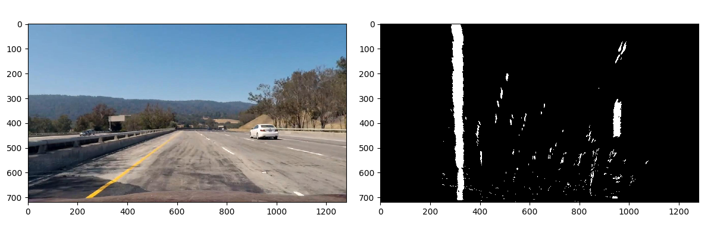
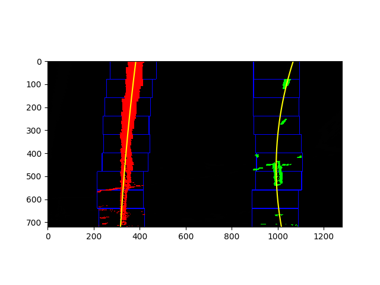
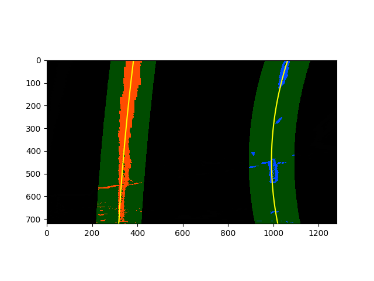
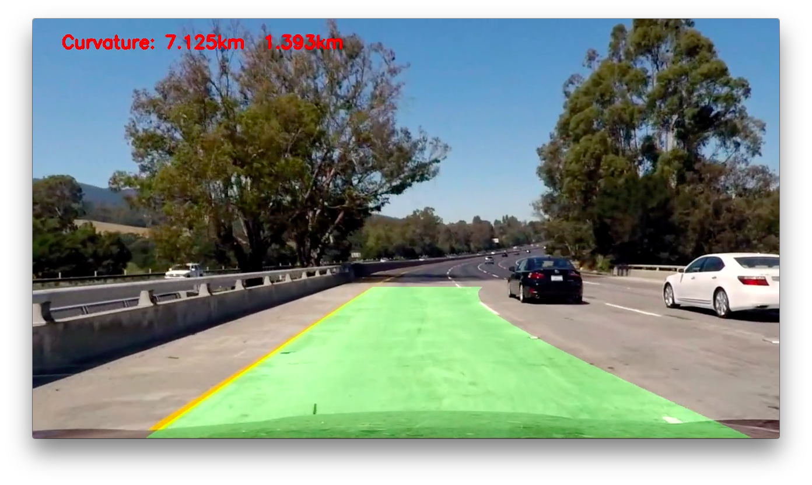
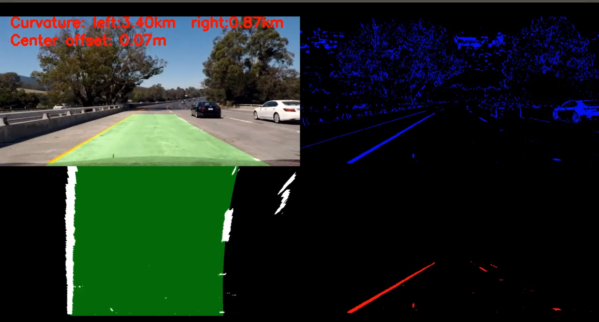
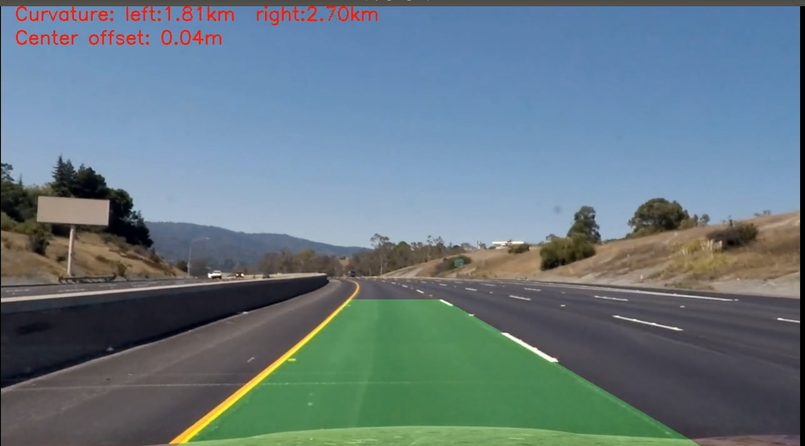
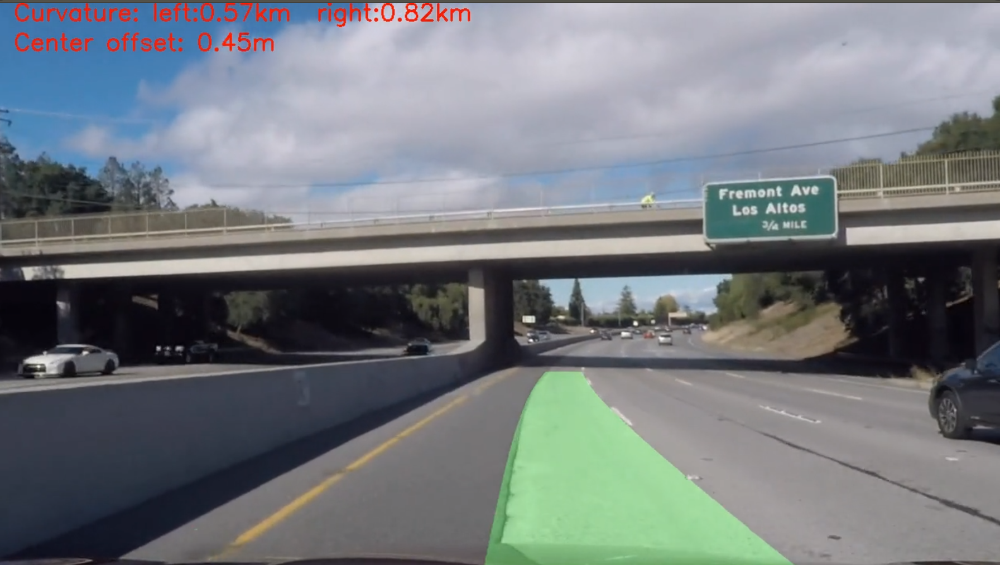

# Advanced Lane Finding Project

### Overview

* Compute the camera calibration matrix and distortion coefficients given a set of chessboard images.
* Apply a distortion correction to raw images.
* Use color transforms, gradients, etc., to create a thresholded binary image.
* Apply a perspective transform to rectify binary image ("birds-eye view").
* Detect lane pixels and fit to find the lane boundary.
* Determine the curvature of the lane and vehicle position with respect to center.
* Warp the detected lane boundaries back onto the original image.
* Output visual display of the lane boundaries and numerical estimation of lane curvature and vehicle position.

[//]: # (Image References)

[image1]: ./examples/undistort_output.png "Undistorted"
[image2]: ./test_images/test1.jpg "Road Transformed"
[image3]: ./examples/binary_combo_example.jpg "Binary Example"
[image4]: ./examples/warped_straight_lines.jpg "Warp Example"
[image5]: ./examples/color_fit_lines.jpg "Fit Visual"
[image6]: ./examples/example_output.jpg "Output"
[video1]: ./project_video.mp4 "Video"


### Camera Calibration


The code for this step is contained in the first code cell of the IPython notebook located in "./examples/example.ipynb" (or in lines # through # of the file called `some_file.py`).  

I start by preparing "object points", which will be the (x, y, z) coordinates of the chessboard corners in the world. Here I am assuming the chessboard is fixed on the (x, y) plane at z=0, such that the object points are the same for each calibration image.  Thus, `objp` is just a replicated array of coordinates, and `objpoints` will be appended with a copy of it every time I successfully detect all chessboard corners in a test image.  `imgpoints` will be appended with the (x, y) pixel position of each of the corners in the image plane with each successful chessboard detection.  

I then used the output `objpoints` and `imgpoints` to compute the camera calibration and distortion coefficients using the `cv2.calibrateCamera()` function.  I applied this distortion correction to the test image using the `cv2.undistort()` function and obtained this result: 

![alt text][image1]

### Pipeline (single images)

#### 1. Provide an example of a distortion-corrected image.

To demonstrate this step, I will describe how I apply the distortion correction to one of the test images like this one:
![alt text][image2]

And after applying the function `undistort`, I got the result like this:


It looks almost the same. Right? 

Nope, you can discovery some different about the white car between two images. It seems that the white car in picture two became larger.

#### 2. Gradient Threshold and Color Threshold

This was a trick part, I try a lot and a lot. At last, go hell to the shadow. This function make me get a petty good result in the video:

```python
def binarize(img, s_thresh=(120, 255), sx_thresh=(20, 255), l_thresh=(40, 255)):
    img = np.copy(img)

    # Convert to HLS color space and separate the V channel
    hls = cv2.cvtColor(img, cv2.COLOR_RGB2HLS).astype(np.float)
    # h_channel = hls[:,:,0]
    l_channel = hls[:, :, 1]
    s_channel = hls[:, :, 2]
    # Sobel x
    # sobelx = abs_sobel_thresh(img, orient='x', sobel_kernel=3, thresh=(0, 255))
    # l_channel_col=np.dstack((l_channel,l_channel, l_channel))
    sobelx = cv2.Sobel(l_channel, cv2.CV_64F, 1, 0)  # Take the derivative in x
    abs_sobelx = np.absolute(sobelx)  # Absolute x derivative to accentuate lines away from horizontal
    scaled_sobel = np.uint8(255 * abs_sobelx / np.max(abs_sobelx))

    # Threshold x gradient
    sxbinary = np.zeros_like(scaled_sobel)
    sxbinary[(scaled_sobel >= sx_thresh[0]) & (scaled_sobel <= sx_thresh[1])] = 1

    # Threshold saturation channel
    s_binary = np.zeros_like(s_channel)
    s_binary[(s_channel >= s_thresh[0]) & (s_channel <= s_thresh[1])] = 1

    # Threshold lightness
    l_binary = np.zeros_like(l_channel)
    l_binary[(l_channel >= l_thresh[0]) & (l_channel <= l_thresh[1])] = 1

    channels = 255 * np.dstack((l_binary, sxbinary, s_binary)).astype('uint8')
    binary = np.zeros_like(sxbinary)
    binary[((l_binary == 1) & (s_binary == 1) | (sxbinary == 1))] = 1
    # binary = 255 * np.dstack((binary, binary, binary)).astype('uint8')
    return binary, channels
```

The resonable result:


Add the mask to remove the sky and the noisy around the lane line:


#### 3. Perspective Transform

The code for my perspective transform includes a function called `warper()`, which appears in lines 107 .  The `warper()` function takes as inputs an image (`img`), as well as source (`src`) and destination (`dst`) points.  I chose the hardcode the source and destination points in the following manner:

```python
bottom_left = [220, 720]
bottom_right = [1110, 720]
top_left = [570, 470]
top_right = [722, 470]
src = np.float32([[top_left,bottom_left,bottom_right,top_right]])

bottom_left = [320, 720]
bottom_right = [920, 720]
top_left = [320, 1]
top_right = [920, 1]
dst = np.float32([[top_left,bottom_left,bottom_right,top_right]])
```

This resulted in the following source and destination points:

| Source        | Destination   | 
|:-------------:|:-------------:| 
| 585, 460      | 320, 0        | 
| 203, 720      | 320, 720      |
| 1127, 720     | 960, 720      |
| 695, 460      | 960, 0        |

I verified that my perspective transform was working as expected by drawing the `src` and `dst` points onto a test image and its warped counterpart to verify that the lines appear parallel in the warped image.After doing the wrap the binary image. It looks like they are almost parallel.:





#### 4. Fit the line to calculate curvature
I use the slide windows to search for the lane line and the procedure can be devide into servel steps:
- Finding the midpoint for the binary image
- use the static result from histogram to find maximun pixel
- use slide window to calculate the mean point, in order to move forward
- use the point what we find to fit the polynominal line



The result is amazing good. Then I reuse the parameter I fit, so that I can easily track the line in frame to framevedio:



I can't wait to apply it into the real picture:


#### 5. Describe how (and identify where in your code) you calculated the radius of curvature of the lane and the position of the vehicle with respect to center.

The function `cal_curvature` in `all_staff.py`line 332 describes how to use it. It looks likes this:
```python
cal_curvature(ploty, left_fit_cr, right_fit_cr)
```
Firstly, I accept the parameter which is fitted from perspective transform image. And then I do some Partial derivative according to Radius of Curvature [formula](https://www.intmath.com/applications-differentiation/8-radius-curvature.php):
$$$

f(y)=Ay^2 +By+C
$$$
$$$
f′(y)=\frac{dx}{dy}=2Ay+B
$$$

$$$
f′′(y)=\frac{d^2x}{dy^2}=2A
$$$

$$$
R_{curve} = \frac{(1 + (2Ay + B)^2)^{(\frac{3}{2})}}{|2A|}
$$$

### Help!! I can not know how to calculate the vehicle with respect to center


#### 6. Provide an example image of your result plotted back down onto the road such that the lane area is identified clearly.

I find that curvature is a good stall. When the lane line suddently disappeared, the region could be weird:


At this time, the curvature can become very small, almost 100 meters. So I set the condition: `if curvature < 500m` I will use the history data. This srategy output a petty good video:





This is the youtube [link](https://youtu.be/ezO9h53kOXw), you can check this video.


### Pipeline (video)

#### 1. Provide a link to your final video output.  Your pipeline should perform reasonably well on the entire project video (wobbly lines are ok but no catastrophic failures that would cause the car to drive off the road!).



Here's a [link to my video result](res_video/project_video_res.mp4). Also you can watch in youtube. Check this [link](https://www.youtube.com/watch?v=EwxtN2JoD3g&feature=youtu.be)

---

### Discussion

#### 1. Briefly discuss any problems / issues you faced in your implementation of this project.  Where will your pipeline likely fail?  What could you do to make it more robust?

- The dotted line sometimes can make the region unstable. So I have to use the history data to smooth the curve. This is tricky. Because it means that I can not detect the lane line and use other technology to avoid it
- The Shadow still a problem, it sometimes can cut off the lane line.
- The line is not very robust. Damm it:




